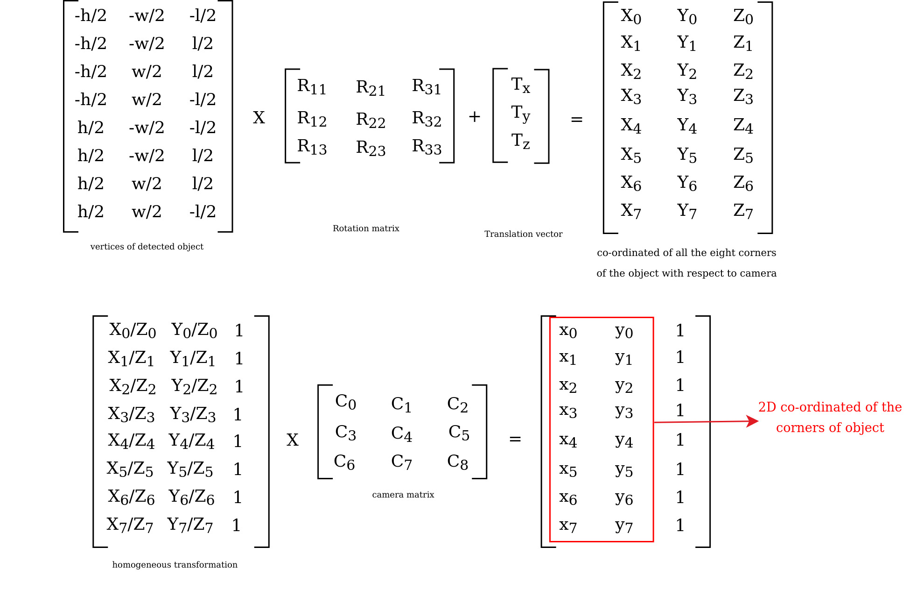

# Edge AI GStreamer Apps for Object 6D Pose Estimation
> Repository to host GStreamer based Edge AI applications for TI devices

This repo adds support for object 6D pose estimation on top of edgeai-gst-apps

## Table of content
- [Supported Devices](#supported-devices)
- [Steps to run](#steps-to-run)
- [Result](#result)
- [About Object 6D Pose Estimation](#about-object-6d-pose-estimation)
- [Model Directory](#model-directory)
- [How to add your own custom post-processing?](#how-to-add-your-own-custom-post-processing)
## Supported Devices

| **DEVICE**              | **Supported**      |
| :---:                   | :---:              |
| AM62A                   | :heavy_check_mark: |
| AM68A                   | :heavy_check_mark: |
| SK-TDA4VM               | :heavy_check_mark: |
| AM69A                   | :heavy_check_mark: |

## Steps to run

1. Clone this repo in your target under /opt

    ```console
    root@tda4vm-sk:/opt# git clone https://github.com/TexasInstruments/edgeai-gst-apps-6d-pose.git
    root@tda4vm-sk:/opt# cd edgeai-gst-apps-6d-pose
    ```

2. Download model for 6D pose estimation

    ```console
    root@tda4vm-sk:/opt/edgeai-gst-apps-6d-pose# ./download_models.sh -d object_6d_pose_estimation
    ```

3. Download sample input video

    ```console
    root@tda4vm-sk:/opt/edgeai-gst-apps-6d-pose# wget --proxy off http://software-dl.ti.com/jacinto7/esd/edgeai-test-data/demo_videos/object_6d_pose_estimation_sample.h264 -O /opt/edgeai-test-data/videos/object_6d_pose_estimation_sample.h264
    ```

4. Run the python app

    ```console
    root@tda4vm-sk:/opt/edgeai-gst-apps-6d-pose# cd apps_python
    root@tda4vm-sk:/opt/edgeai-gst-apps-6d-pose/apps_python# ./app_edgeai.py ../configs/object_6d_pose_estimation.yaml
    ```

5. Compile cpp apps

    ```console
    root@tda4vm-sk:/opt/edgeai-gst-apps-6d-pose# ./scripts/compile_cpp_apps.sh
    ```

5. Run CPP app

     ```console
    root@tda4vm-sk:/opt/edgeai-gst-apps-6d-pose# cd apps_cpp
    root@tda4vm-sk:/opt/edgeai-gst-apps-6d-pose/apps_cpp# ./bin/Release/app_edgeai ../configs/object_6d_pose_estimation.yaml
    ```

## Result    
</br>
<figure>
<p align="center">

</p>

<p align="center">
<figcaption align = "center"><b>The above visualization is done assuming the YCBV camera (Asus Xtion Pro Live RGB-D )intrinsics even though the frames are captured with Logitech C270 camera. Even then the above visualization looks correct. However, it is recommended to use the same camera matrix for training and  visualization.</p></b></figcaption>

</figure>

## About Object 6D Pose Estimation
Object pose estimation aims to estimate the 3D orientation and 3D translation of objects in a given environment. It is useful in a wide range of applications like robotic manipulation for bin-picking, motion planning, and human-robot interaction task such as learning from demonstration.

### YOLO-6D-Pose Based Multi-Object 6D Pose Estimation Models

* YOLO-6D-Pose a multi-object 6D pose estimation framework which is an enhancement of the popular YOLOX object detector. The network is end-to-end trainable and detects each object along with its pose from a single RGB image without any additional post-processing . It uses a certain parameterization of the 6D pose which is decoded to get the final translation and rotation. These models achieve competitive accuracy without further refinement or any intermediate representations.

* YOLO-6D-Pose based models are supported as part of TI Deep Learning Library(TIDL) with full hardware acceleration. These models can be trained and exported following the instruction in this [repository](https://github.com/TexasInstruments/edgeai-yolox). 

* The exported models can be further compiled in edgeai-benchmark [repository](https://github.com/TexasInstruments/edgeai-benchmark) with the corresponding [configs](https://github.com/TexasInstruments/edgeai-benchmark/blob/master/configs/object_6d_pose_estimation.py)

## Model Directory

The default model downloaded from the model-zoo will be present under /opt/model_zoo in the target. It is a directory containing the model, artifacts and other necessary information including dataset.yaml file which contains the dataset information of the model and params.yaml file which contains information like the task-type of the model, preprocess information, postprocess information etc.

```
/opt/model_zoo/ONR-6DP-7200-yolox-s-6d-object_pose-640x480
└───params.yaml
└───dataset.yaml 
└───artifacts
    └───allowedNode.txt
    └───detections_tidl_io_1.bin
    └───detections_tidl_net.bin
└───model
    └───yolox_s_object_pose_ti_lite_640x480_57p75.onnx
```
## How to add your own custom post-processing?

The parent repo of this fork i.e. edgeai-gst-apps supports post-processing for image classification, object detection and semantic segmentation. Since we are adding a new type of task, we need to write out own post-processing logic for it. The application has both python and C++ variants so the same post-processing logic needs to be added to both. It is recommended to start with python and then eventually move to C++. OpenCV, a popular computer vision library is used to draw appropriate detections on the frames.

Post-processing can be simple(ex: image classification) but in some cases the output from the model cannot be directly translated to a visual format. Some complex processing might be needed to convert the output from the deep learing network to a format that can be visualized. A detailed explanation about the post processing code can be found below.

The code changes done to add post-processing logic for object-6d-pose-estimation can be found in this [commit](https://github.com/TexasInstruments/edgeai-gst-apps/commit/071701f903c620eab703037c5005741fc3382c3a).

### <ins>Basic summary of the code changes</ins>
* **apps_python**: Adding new post process class for object 6d pose estimation in post_process.py
* **apps_cpp**:    Make a new post process class for object 6d pose estimation and modify post_process_image.cpp to call the newly created class appropriately
* **configs**:     Create a new config file with the downloaded/custom model

### <ins>Detailed explanation</ins>
#### Interpretation of Model Output 
* The default ONNX model downloaded above takes an RGB image of 640x480 as input and predicts a 15 dimensional tensor for each detected object.
* First six elements are the box parameters: $\bf \{x_{min}, y_{min}, x_{max}, y_{max}, box_{conf}, class_{id}\}$
* Remaining nine element are associated with the pose of the object:
    * First six elements corresponds to the first two columns $\bf \{r_{.1}, r_{.2}\}$ of rotation matrix $\bf R$ in the following order: $\bf \{r_{.1}^T, r_{.2}^T\} = \{r_{11}, r_{21}, r_{31}, r_{12}, r_{22}, r_{32}\}$. The third column of the rotation matrix can be obtained by taking the cross-products of the first two columns as: $\bf r_{.3} = r_{.1} \times \bf r_{.2}$
    * Remaining three element are the translation vector  $\bf t=\{t_x, t_y, t_z\}$

<p align="center">

</p>

#### Cuboid Visualization of the Output Pose
* The inferred pose is commonly visualized by drawing a cuboid around the object.
* All 6D pose estimation datasets contain a CAD model corresponding to each object. These CAD models are used in evaluation metric like ADD(S) as well as in several visualizations.
* For cuboid visualization, we pick the eight corner points of an object and transform it with the predicted pose as: $\bf x_c = Rx_o + t$. Here, $\bf x_o$ and $\bf x_c$ are the corner points w.r.t the object coordinate and camera coordinate respectively.
* The transformed corner points are projected on the image with camera intrinsic matrix. These corners are further connected via lines in a predetermined order for the complete visualization.
* Note that the camera intrinsic matrix and the model parameters corresponding to each object need to be updated depending on the dataset.

#### Post-Processing Code

A detailed explanation of python code for post-processing is given below. The same logic applies for C++ as well.
##### <ins>Initialization</ins>

The \_\_init\_\_ function of the class initializes some constant data. The default 6D pose estimation model that is downloaded above was trained on YCBV Dataset. The code also has support for Linemod dataset. These dataset can be found [here](https://bop.felk.cvut.cz/datasets/).

* **camera_matrix**

Camera matrix corresponding to a particular dataset. Camera matrix is required to convert 3D co-ordinates obtained from the model result and translate it to 2D co-ordinate for drawing and vizualization.

* **vertices**

```python
self.YCBV_VERTICES = np.array(
        [
            [51.1445, 51.223, 70.072],
            [35.865, 81.9885, 106.743],
            [24.772, 47.024, 88.0075],
                    .
                    .
                    .
        ],dtype=np.float32)
```

Each dataset contains a N number of objects having fixed dimensions. This can be captured in Nx3 dimension array where N is number of classes in the particular dataset(YCBV in this case). For each object, the three data members are **height/2**, **width/2**, **length/2** in millimeters. This can be used to get the eight corners of the object with respect to center. 

The code snippet below can be used to generate the vertices for each object according to given height,width and length.

```python
self.YCBV_VERTICES = np.array(
        [
            [51.1445, 51.223, 70.072],
            [35.865, 81.9885, 106.743],
            [24.772, 47.024, 88.0075],
                    .
                    .
                    .
        ],dtype=np.float32)

vertices_order = np.array(
            [
                [-1, -1, -1],
                [-1, -1, 1],
                [-1, 1, 1],
                [-1, 1, -1],
                [1, -1, -1],
                [1, -1, 1],
                [1, 1, 1],
                [1, 1, -1],
            ],dtype=np.float32)

self.vertices = self.YCBV_VERTICES[:, None, :] * vertices_order
```

<p align="center">

</p>

##### <ins>Post-process logic</ins>

The underlying dl-inference engine that edgeai-gst-apps uses is capable of batch processing hence it gives out a list results. Since we are processing one frame at a time, each batch contains single frame. This ensures that the first member of the results list is the actual result. The obtained result is a tensor of fixed height and width, where width corresponds to the outputs for each detection and height corresponds to the number of detections in a single frame. Here is the visualization of the output from default 6D pose estimation model downloaded above. The output from this model is contiguous in memory.

<p align="center">

</p>

```python
def __call__(self, img, result):
    # squeeze function is use to squash single dimensional entries from the array
    result = np.squeeze(result[0])
    for det in result:
        '''
            box: 2D bounding box
            score: confidence
            cls: class id
        '''
        box, score, cls = det[:4], det[4], int(det[5])

        '''
            viz_threshold (visualisation threshold) is user configured parameter
            which can be modified in config file
        '''
        if score > self.model.viz_threshold:
            r1, r2 = det[6:9, None], det[9:12, None]
            r3 = np.cross(r1, r2, axis=0)
            rotation_mat = np.concatenate((r1, r2, r3), axis=1)
            translation_vec = det[12:15]
            cuboid_corners_2d = self.project_3d_2d(self.vertices[int(cls)], rotation_mat, translation_vec)
```

The obtained result contains the rotational and translational vector of the centroid of the object with respect to camera co-ordinated. 
Rotation vector with respect to two axis is obtained and the vector for third axis is the cross product of the two (basic co-ordinate geometry).

Multiplying the vertices of the particular object detected with the rotational matrix and adding the translational vector will give the resultant co-ordinated for each of the eight corners of the object. These are the 3D co-ordinates that needs to be translated to 2D plane with respect to camera.

```python
def project_3d_2d(self, pts_3d, rotation_mat, translation_vec):
    '''
        pts_3d: vertices of the object
        rotation_mat: rotation matrix obtained
        translation_vec: translation vector
    '''
    xformed_3d = np.matmul(pts_3d, rotation_mat.T) + translation_vec

    # convert 3d co-ordinated to 2d plane as a projection
    xformed_3d[:, :3] = xformed_3d[:, :3] / xformed_3d[:, 2:3]
    projected_2d = np.matmul(xformed_3d, self.camera_matrix)[:, :2]

    '''
        projected 2d is 8x2 array, where 8 represents the 8 vertices/corners of object
        and 2 data members are x and y co-ordinated.
    '''
    return projected_2d
```

<p align="center">

</p>

Finally the obtained output can be visualized by drawing a cuboid and label name. The resultant output co-ordinate is with respect to the 640x480 input image to the network. It can be scaled up or down if the output frame is of other dimension. Opencv functions are used to draw simple shapes and text.

```python
def draw_cuboid_2d(self, img, cuboid_corners, color, thickness):
    box = np.copy(cuboid_corners).astype(np.int32)
    '''
        self.x_offset = output_width/input_width
        self.y_offset = output_height/input_height
    '''
    box = [
        (int(kpt[0] * self.x_offset), int(kpt[1] * self.y_offset)) for kpt in box
    ]
    # Draw circles on the edges
    for i in box:
        cv2.circle(img, i, thickness + 3, color, -1)
    # back
    cv2.line(img, box[4], box[5], color, thickness)
    cv2.line(img, box[5], box[6], color, thickness)
    cv2.line(img, box[6], box[7], color, thickness)
    cv2.line(img, box[7], box[4], color, thickness)
    # sides
    cv2.line(img, box[0], box[4], color, thickness)
    cv2.line(img, box[1], box[5], color, thickness)
    cv2.line(img, box[2], box[6], color, thickness)
    cv2.line(img, box[3], box[7], color, thickness)
    # front
    cv2.line(img, box[0], box[1], color, thickness)
    cv2.line(img, box[1], box[2], color, thickness)
    cv2.line(img, box[2], box[3], color, thickness)
    cv2.line(img, box[3], box[0], color, thickness)
    return img
```